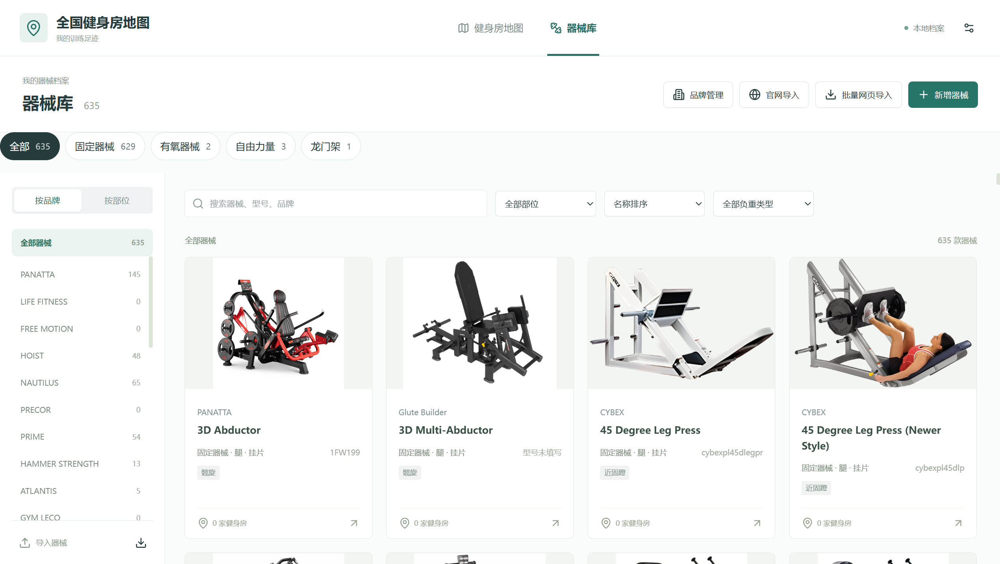

# 全国健身房地图

公开网页版用于浏览健身房地图、器械库和场馆器械配置，可在电脑和手机打开并分享详情。Windows 桌面应用继续负责资料管理；个人到访记录和备注保留本地，公共基础资料通过维护者发布的共享库订阅更新。

[打开网页版](https://player9826.github.io/national-gym-map/) · [下载桌面版](https://github.com/player9826/national-gym-map/releases/latest) · [提出资料修改建议](https://github.com/player9826/national-gym-map/issues/new/choose)

网页版无需安装和登录，支持地图、品牌与器械筛选、图片和详情分享；不提供个人打卡或在线编辑。网页代码与公开资料更新通过独立工作流发布，使用者刷新即可获取新版。[网页开发与发布说明](docs/web.md)



安装后在“数据与设置 → 共享资料库”点击“检查共享数据”，预览后确认同步，即可浏览图文资料；下载的图片保存在本地，后续只下载有变化的图片。

## 安装与使用

在本仓库 **Releases** 页面下载 `NationalGymMap-Setup.exe`。安装后打开“全国健身房地图”，为个人资料选择一个独立、可写的数据目录。程序升级与个人数据分开存放；安装包尚未取得发布者数字签名。

- 地图与列表支持搜索、筛选、悬停摘要及点击查看完整场馆详情。
- 器械分为固定器械、有氧器械、自由力量、龙门架。固定器械按训练部位和应用标签分类，自由力量按哑铃、杠铃、史密斯、力量架分类。
- 支持手动录入、官网单品读取、目录批量导入和浏览器辅助读取。批量候选先分类、检查重复，再确认写入；已有资料可只补充缺失字段。
- 支持 PDF（Portable Document Format，便携式文档格式）选页导入及 AVIF（AV1 Image File Format，AV1 图像文件格式）图片。
- 场馆与器械可双向关联；提供备份、恢复和数据目录迁移。

官网可能返回访问限制或网络错误。应用提供浏览器辅助与文档导入入口，不保证所有网站可自动读取。扫描版产品册保留页面图片，需要手动填写名称等字段。

## 共享资料与版本更新

应用程序版本与共享数据独立更新。软件发布在本仓库 Releases；共享库由维护者审核后发布，订阅者先查看变更再应用。具体地址与操作见[发布和共享指南](docs/publishing.md)。

共享库仅用于场馆基础资料、器械资料、两者关联及获准分享的图片。个人去过状态、私人备注、原始测评、设置和完整备份不属于公开共享范围。请勿把个人数据目录直接提交到仓库。

发现资料错误可通过本仓库 **Issues → 场馆或器械资料修改建议** 提交可核验的修改和来源。维护者审核后发布下一份共享库，其他订阅者再更新。

## 数据保护

个人数据目录中的 `database/data.json` 保存记录，`gyms/` 与 `equipment/` 保存图片，`imports/` 保存导入原文，`backups/` 保存完整备份。完整备份用于个人恢复和迁移，不应公开上传。迁移成功后仍保留原目录；不要把其他个人文件混放到数据根目录。

更新程序或应用共享资料前保留备份。公开图片前确认有分享权限；从网页抓取成功不代表图片已获得再分发许可。

## 开发与验证

需要 Windows 和 Node.js（JavaScript 运行环境）22.12 或更新版本。正式用户无需安装开发工具。

```powershell
npm.cmd ci
npm.cmd test
npm.cmd run build
npm.cmd start
npm.cmd run test:desktop
npm.cmd run dist
```

npm（Node Package Manager，Node.js 包管理器）用于安装依赖与运行脚本。应用使用 Electron、React 和 Leaflet。构建产物位于 `release/`，包含安装包、更新清单及校验文件。桌面测试使用隔离目录；部分额外测试需要联网或特定磁盘条件，不等同于所有电脑与网站都已通过验证。

维护者可以在 Actions 手动运行 Windows 构建，也可以推送与包版本一致的版本标签。流程仅创建发布草稿，检查后再公开。[发布指南](docs/publishing.md)说明详细步骤。

## 资料与第三方组件

[器械模型与批量导入](docs/equipment.md) · [第三方声明](THIRD_PARTY_NOTICES.md)

地图内置全球国家轮廓、主要城市与中国省界，不请求外部街道瓦片；来源及相关组件声明见第三方声明文件。此仓库尚未声明项目代码的开放源代码许可证；公开可见不代表自动授予再分发许可，第三方组件遵循各自许可证。
